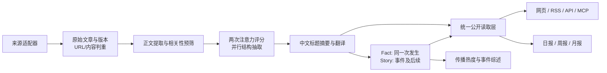

# AIHOT 实现与数据源分析，以及 AIReport Skill 改进评审

评审日期：2026-09-29，北京时间。对象：AIHOT 公共仓库提交 `589f79eff09470b31ba8a7f1d9eb62d36ff2be6c`；AIReport 当前工作区，HEAD 为 `41f3b121ef7738c08f6e7a810fec7f8a7cecea17`。

本地已有未提交的日报 1.2 / 通用与办公 Agent 编辑治理改动。本报告按这些实际文件评审，不把它们说成已经提交、发布或经过完整验收。本次只读项目实现并进行匿名接口探测、内存反例验证；只新增本研究报告，未修改 skill、代码、配置、运行数据，也未生成或发送日报。

## 1. 最重要的结论

**AIHOT 最值得借鉴的是信息产品的工程组织：来源适配、文章与事件分离、阶段处理、编辑回归评测、统一公开读取、异常状态与更正传播。你的 AIReport 最值得保留的是证据强弱与行动资格分离、明确时间窗口、读者决策画像，以及邮件和钉钉各自的交付验收。**

两者解决的问题不同。AIHOT 面向持续浏览热点的网站用户，侧重“不断收集，筛出值得读的内容，组织成事件”；AIReport 面向团队决策，必须回答“发生了什么、证实到哪一步、对什么选择有影响、是否值得投入”。因此，推荐借鉴若干机制，不建议把现有 skill 改造成 AIHOT 的复制品。

本次发现最值得优先处理的四组问题：

1. **AIHOT 接入的覆盖和时间语义有偏差。** 当前 skill 已接入 AIHOT，但 selected 成功就可能停止，不再看 all；all 本身又是过滤后的公开池；默认时间轴与本地日报窗口不一致。
2. **部分宣称为硬门的要求还只存在于提示词。** 离线反例显示，明显窗口外的已选条目仍可通过当前 artifact 校验器；核心源失败阈值也缺少相应程序兜底。
3. **投递失败和投递结果未知没有充分区分。** 已接收后的连接退出异常可能触发重发，部分收件人拒收可能被记为整体成功。
4. **质量提升需要真实编辑回归样本和持久证据档案。** 继续堆约束文字、字段或小粒度确认步骤，未必能证明少漏重大事件、少写无依据结论。

## 2. AIHOT 的产品与架构

### 2.1 开源范围

仓库声明是线上代码的一份快照，公开框架、提示词、筛选门槛和示范源；**未公开线上完整信源名单、运营数据库和完整人工标注集**。所以可以完整研究公开实现，不能据此还原线上全部来源、精选质量、实际成本或长期可用性。代码采用 MIT，名称、Logo 与第三方素材的权利另有边界。[项目说明](https://github.com/KKKKhazix/AIHOT/blob/589f79eff09470b31ba8a7f1d9eb62d36ff2be6c/README.md)

### 2.2 三个应用进程与一个业务核心

| 层 | 实际职责 | 实现位置 |
|---|---|---|
| Web | React Router 服务端渲染，展示首页、事件、日报、搜索、专题与后台，通过 HTTP 读 API | `apps/web/` |
| API | Fastify；站内 API、公开 API、RSS、MCP、后台接口、分享图等 | `apps/api/` |
| Worker | 持续采集、调用模型、翻译、归组、热度、日报周报月报、恢复和告警 | `apps/worker/` |
| Backend | 内容入库、来源适配、编辑、事件、发布投影、供应商、运营逻辑 | `packages/backend/` |
| 行业包 | 来源、分类、主题、品牌、筛选与写作提示词、功能开关 | `industry/` |
| PostgreSQL | 业务数据、分析结果、事件关系、回执、投递记录、运行记录；pg-boss 使用同一数据库提供队列 | `database/`、`jobs/queue.ts` |

页面读取已处理好的数据，通常不会因读者打开网页而调用模型。队列入队可以与业务写入使用同一数据库事务，降低“内容保存成功但下一步任务没创建”的风险。各阶段独立设置重试策略，发送类副作用与一般分析任务分开处理。[架构](https://github.com/KKKKhazix/AIHOT/blob/589f79eff09470b31ba8a7f1d9eb62d36ff2be6c/docs/architecture.md)、[队列实现](https://github.com/KKKKhazix/AIHOT/blob/589f79eff09470b31ba8a7f1d9eb62d36ff2be6c/packages/backend/src/jobs/queue.ts#L27)



这里的 Fact 是事件组织层的名字，不能理解为“已经证实的事实”。模型将报道归到同一个 Fact，并不自动提高报道真实性。

## 3. 数据源完整清单与接入机制

### 3.1 仓库带的 18 个资讯示范源

配置实际包含 **18 个 RSS 适配器实例：10 个 T1、8 个 T2；其中响应格式有 RSS，也有 Atom**。它们全部属于 editorial 参与模式，默认关闭站内全文与全文 RSS 再分发；初始导入上限为每源 8 条。种子间隔有 60、120、180 分钟，后续可被动态调度调整。T1 是配置对来源身份的标注，不是其所有主张都已独立验证。[完整来源配置](https://github.com/KKKKhazix/AIHOT/blob/589f79eff09470b31ba8a7f1d9eb62d36ff2be6c/industry/sources.json)

| 来源 | 档位 | 配置的 Feed | 主要覆盖与边界 |
|---|---|---|---|
| OpenAI News | T1 | [RSS](https://openai.com/news/rss.xml) | 官方发布、公司与产品消息；不是所有开发者接口变更 |
| Google DeepMind | T1 | [RSS](https://deepmind.google/blog/rss.xml) | 模型与研究发布；不覆盖全部 Google 产品 |
| Google Research | T1 | [RSS](https://research.google/blog/rss/) | 研究与技术；不能把论文实验直接当产品上线 |
| Hugging Face Blog | T1 | [RSS](https://huggingface.co/blog/feed.xml) | 平台、开源与技术文章；博客不等于全部新权重列表 |
| Microsoft Research | T1 | [RSS](https://www.microsoft.com/en-us/research/feed/) | 研究与方法；不等于 Microsoft 365 更新日志 |
| NVIDIA Blog | T1 | [RSS](https://blogs.nvidia.com/feed/) | 基础设施、模型、合作与案例；含大量公司宣传 |
| AWS Machine Learning Blog | T1 | [RSS](https://aws.amazon.com/blogs/machine-learning/feed/) | 云服务、部署与方法；需区分平台教程与通用经验 |
| GitHub Blog · AI & ML | T1 | [RSS](https://github.blog/ai-and-ml/feed/) | 开发者与 Copilot 生态；可补 releases/changelog |
| Mistral AI | T1 | [RSS](https://mistral.ai/rss.xml) | 官方模型与产品；本次重定向到 `/news/rss` |
| Berkeley AI Research | T1 | [RSS](https://bair.berkeley.edu/blog/feed.xml) | 研究团队博客，慢信号；不能用低频推断故障 |
| The Verge · AI | T2 | [RSS/Atom](https://www.theverge.com/rss/ai-artificial-intelligence/index.xml) | 产品、公司与社会影响报道 |
| TechCrunch · AI | T2 | [RSS](https://techcrunch.com/category/artificial-intelligence/feed/) | 创业公司、融资、产品；需补一手证据 |
| Ars Technica · AI | T2 | [RSS](https://arstechnica.com/ai/feed/) | 技术、产品与政策报道 |
| MIT Technology Review · AI | T2 | [RSS](https://www.technologyreview.com/topic/artificial-intelligence/feed) | 研究解读、影响与深度报道；订阅不保证全文可取 |
| The Decoder | T2 | [RSS](https://the-decoder.com/feed/) | 模型、产品与行业报道 |
| Simon Willison | T2 | [Atom](https://simonwillison.net/atom/everything/) | 原创实测、工程实践，也包含非 AI 内容 |
| Import AI | T2 | [RSS](https://importai.substack.com/feed) | 周度研究与行业解读；不是逐条发布源 |
| Latent Space | T2 | [RSS](https://www.latent.space/feed) | 工程、访谈与生态；发布时间不等于所讨论事件时间 |

**本次实测：**2026-09-29 10:02 北京时间，从本机匿名读取以上 18 个地址，18 个均为 HTTP 200，16 个可解析为 RSS、2 个为 Atom；未遇超时或 2 MiB 响应上限截断。Mistral 虽返回 `text/plain`，正文仍是可解析 RSS，因此不能只靠 Content-Type 判死刑。这是单次可达性验证，不是运行 SLA，也不证明 feed 穷尽所有更新或文章正文可读。

这份名单偏海外、偏公开资讯。**缺少中国实验室、国内办公 Agent、国内政策，以及很多产品 release 面，是示范包的边界，不等于线上 AIHOT 没有这些源。**不能直接用这 18 个替代 AIReport 现有来源网络。

### 3.2 六种来源适配器

| 类型 | 输入与解析 | 主要成本/依赖 | 实际使用边界 |
|---|---|---|---|
| `rss` | RSS/Atom；标题、链接、日期、摘要/正文与分类过滤 | 通常无付费采集服务 | feed 截断与正文省略仍可能漏信息 |
| `web_list` | HTML 选择器、详情页补取；也支持 Markdown/Jina 和 Docusaurus changelog | Jina 回退可能付费 | 页面结构、日期语义、锚点身份最易漂移 |
| `json_list` | JSON 列表与字段路径，如 GitHub Releases | 上游配额/认证视接口而定 | 必须区分配置支持与真实分页能力，不能把单次列表说成全历史 |
| `x_search` | SocialData 搜索账号；简单账号查询可以合并，处理分页与位置 | 第三方按请求付费 | 外部平台搜索覆盖、限流与游标推进约束 |
| `mp_account` | Dajiala/极致了读取公众号列表及正文 | 第三方按请求付费 | 抓得到不等于获得全文再分发许可 |
| `external` | 由外部脚本推送材料，进入共用后续管线 | 自有采集器成本；需 ingest token | 自动创建的来源默认 isolated，要显式改成 editorial 才能公开 |

来源有几组互不等价的属性：

- `tier`：来源档位，影响精选门槛。
- `participation_mode`：editorial 可进入公开资讯；hot_signal 只参与热度；isolated 不公开。
- `first_party`：是否事件当事方；帮助选代表报道，不能自动证明效果宣传。
- `site_fulltext` / `syndicate_fulltext`：站内展示与 RSS 再分发分别控制。
- `signal_group_id`：把多个来源映射到同一个传播参与者，避免同一主体多入口重复加热。

配置键有白名单，未知键会报错。这能防止拼错字段后悄悄退回通用解析，但不是完备的字段类型、必填与跨字段语义验证。[来源文档](https://github.com/KKKKhazix/AIHOT/blob/589f79eff09470b31ba8a7f1d9eb62d36ff2be6c/docs/sources.md)、[配置键检查](https://github.com/KKKKhazix/AIHOT/blob/589f79eff09470b31ba8a7f1d9eb62d36ff2be6c/packages/backend/src/sources/config-keys.ts)

### 3.3 采集与时间治理：优点和限制

值得学习的设计包括：采集位置只在相应处理成功后推进、保存来源最近成功/失败、初次导入与历史回灌降到历史时间线、根据近七日产出调整抓取间隔，以及按来源查看试抓结果与失败原因。首次发现时已旧于 48 小时的文章不作为今天的新内容推送。[采集实现](https://github.com/KKKKhazix/AIHOT/blob/589f79eff09470b31ba8a7f1d9eb62d36ff2be6c/packages/backend/src/sources/collect.ts)、[材料入库](https://github.com/KKKKhazix/AIHOT/blob/589f79eff09470b31ba8a7f1d9eb62d36ff2be6c/packages/backend/src/content/materials.ts)

但不能概括成“有适配器就有完整覆盖”。Feed 返回上限、网页前几页、第三方搜索窗口、付费预算和全文失败都会限制实际覆盖；空结果要解释成该接口此次观察为空。

发现两处值得补回归的具体实现问题：

1. `web_list` HTML 分支允许 `preserveUrlFragment` 放行同页锚点，却没有给结果设置保留锚点的 `identityKey`；通用 URL 身份又默认去掉 hash。结果是同一 changelog 页的 `#a`、`#b` 可能合并，丢失独立条目。RSS/Docusaurus 分支有不同处理，不能笼统说所有锚点都失效。[网页解析](https://github.com/KKKKhazix/AIHOT/blob/589f79eff09470b31ba8a7f1d9eb62d36ff2be6c/packages/backend/src/sources/web-list.ts#L137)、[URL 身份](https://github.com/KKKKhazix/AIHOT/blob/589f79eff09470b31ba8a7f1d9eb62d36ff2be6c/packages/backend/src/lib/url.ts#L48)
2. `parseLooseDate` 先用 `Date.parse`，成功就返回，再考虑配置时区。对 `2026-09-26` 这种纯日期，JavaScript 先解释为 UTC 零点，`publishedAtUtcOffset=+08:00` 不再生效，与北京时间零点差 8 小时。节点内置日期行为已只读验证，完整采集管线未运行。[日期解析](https://github.com/KKKKhazix/AIHOT/blob/589f79eff09470b31ba8a7f1d9eb62d36ff2be6c/packages/backend/src/sources/web-list.ts#L12)

全文权限也有一个边界：普通新闻正文遵循 `body_mode/site_fulltext`，但 X 内容在详情与 Markdown 分支直接展示帖子正文。因此文档“默认只显示摘要”不能不加区分地套到所有来源。[详情读取](https://github.com/KKKKhazix/AIHOT/blob/589f79eff09470b31ba8a7f1d9eb62d36ff2be6c/packages/backend/src/publication/detail.ts#L83)

## 4. 自动编辑：实际做了什么

### 4.1 预筛、双评分、写作和结构化

1. 普通网页缺正文且处于 pending 状态时先排队补正文；Readability 提取不足时可以回退 Jina。
2. 相关性预筛输出 PASS/BLOCK/UNKNOWN，只有 BLOCK 明确排除，UNKNOWN 继续评估，体现宽召回。
3. **同一模型、同一提示词、同一输入串行打两次 0–100 的注意力分数**。T1 平均至少 60、T1_5 至少 65、T2 至少 76 才精选。
4. 评分同时另做结构化：抽取类别、主体和事件关系需要的事实框架。
5. 精选或平均分严格高于 50 的未精选材料做较完整的理解写作；其余走更轻的摘要/翻译路径。
6. 结果绑定文章 revision，旧输入分析结果不覆盖新输入的处理状态。

[主编辑流程](https://github.com/KKKKhazix/AIHOT/blob/589f79eff09470b31ba8a7f1d9eb62d36ff2be6c/packages/backend/src/editorial/analyze.ts#L172)、[门槛配置](https://github.com/KKKKhazix/AIHOT/blob/589f79eff09470b31ba8a7f1d9eb62d36ff2be6c/industry/selection.ts)

**两次评分是重复采样，不是两家模型独立事实核查。**它可能降低随机波动，无法自动抵消同模型、同提示词的系统偏差；实际降低多少，必须由样本测量。归组复核可以换模型，但默认同样是 default，代码不强制跨供应商。

**先抓正文也不是“无全文就不精选”的硬门。**正文提取失败进入 unconfirmed 后，评分输入可以退回 excerpt/title，却仍用“完整正文”标签包装；内容最长截取 60,000 字。评分本身不看图片，图片是在后续理解写作阶段才可能使用。这会把材料充分性差异隐藏掉，AIReport 不宜照搬。[评分输入](https://github.com/KKKKhazix/AIHOT/blob/589f79eff09470b31ba8a7f1d9eb62d36ff2be6c/packages/backend/src/editorial/analyze.ts#L87)

### 4.2 真正值得学习的编辑问题

评分提示词按模型发布、产品、方法工具、论文、行业事件、观点、教程分型，再考虑实质份量、信息增量、材料内证据、读者共振和可用性。其专业价值在于提醒编辑：

- 一条消息的行业意义和今天能否直接用，是不同问题。
- 官方公告能证明发布动作，不能自动证明厂商自报效果。
- 短公告也可能是重大事件，长论文也可能只有很小增量。
- 转述者、原创实测者和事件当事方应区分。
- 案例如果没有任务、规模、成本、质量或可迁移方法，不能仅凭合作品牌就赋予高价值。
- 预告、测试、灰度和正式可用不能混写。

这些问题适合变成 AIReport 的编辑自检或真实难例。**不推荐搬入五轴固定权重和精选分数线**：这既与现有项目要求冲突，也会把“证据不足但需跟进”“很重要但暂时不能行动”等不同情况压成一个数字。AIHOT 最终只输出 attentionScore，内部五轴并未保存，也无法从存储结果重算权重是否执行正确。[评分提示词](https://github.com/KKKKhazix/AIHOT/blob/589f79eff09470b31ba8a7f1d9eb62d36ff2be6c/industry/prompts/selection-score.md)、[写作提示词](https://github.com/KKKKhazix/AIHOT/blob/589f79eff09470b31ba8a7f1d9eb62d36ff2be6c/industry/prompts/content-understanding.md)

## 5. 去重、事件与热度

### 5.1 把“同文”“同一次发生”“同事件后续”分开

AIHOT 用 Article 表达文章，用 Fact 表达同一次发生，用 Story 表达事件及直接后续。模型关系包括 SAME_OCCURRENCE、SAME_STORY、UNRELATED、ROUNDUP。这样同一模型发布的官网、媒体稿不必占据多张卡片，但正式开放、独立测评等后续仍可挂回原事件。

向量以标题和摘要召回过去 14 天的候选事实，再让模型判断关系；低相似度合并与跨 Story 合并有额外复核。人工修正优先，合并保留旧链接，聚类失败可先独立发布后补处理。它比单纯标题相似度去重更贴近读者的阅读对象。[归组](https://github.com/KKKKhazix/AIHOT/blob/589f79eff09470b31ba8a7f1d9eb62d36ff2be6c/packages/backend/src/events/group.ts)、[关系定义](https://github.com/KKKKhazix/AIHOT/blob/589f79eff09470b31ba8a7f1d9eb62d36ff2be6c/packages/backend/src/events/relate.ts)

限制：判断大量使用摘要与事实框架，并非逐篇原文核查；模型置信度不是经校准的正确概率。代码注释中的历史标注指标未附完整公开数据，本次没有独立复现，不作为生产准确率。

AIReport 可先复用既有 tracking_ref/event_slug 与候选台账，补充普通事件的稳定身份，以及“重复/实质更新/更正”关系，由 AI 判定。只有后续资料规模确实使人工式候选比较成为瓶颈，才考虑向量检索。

### 5.2 热度是在衡量传播

热度大致为 `10 × Σ 0.5^(参与者最近发声距今小时数 / 24)`，仅计最近 48 小时、每个参与者一次；至少两个参与者且至少一个 editorial 来源。来源延迟时尝试按共同可观测来源比较趋势。

优点是重复采集和同主体多篇转发不会简单线性加热。限制是“参与者独立”依赖分组配置，不能证明事实来源独立，转载网络、组织化传播仍可能放大热度。**热度可以提示值得补漏的事件，不能决定事实置信度或团队投入。**[热度实现](https://github.com/KKKKhazix/AIHOT/blob/589f79eff09470b31ba8a7f1d9eb62d36ff2be6c/packages/backend/src/events/hot.ts#L54)

代码中还有一个时间窗口问题：先筛 `[t-48h,t]`，再计算六小时前的热度，导致本应属于上一期 `[t-54h,t-6h]` 的早期参与者被漏掉。举例：只在 50 小时前发声的来源，当前应贡献 0，但六小时前未乘 10 的衰减贡献应为 `2^(-44/24)≈0.280616`；现有前置过滤使前值也为 0，可能高估增长。此为 SQL 范围静态分析与数值复算，未执行数据库回归。

## 6. 日报、周报、事件综述与对外出口

### 6.1 成刊是已精选内容的再组织

- 日报按北京时间前日 08:00 至当日 08:00，取已公开精选、排除历史回灌，Fact 内优先一手代表稿，再排除近期已覆盖内容。
- 每栏目有固定容量；导语只读取按分数排序的部分标题与短摘要。
- 周报/月报直接从对应期间的精选 publications 取候选，并非拼接每日 HTML；分别取前 40/60 条，每条摘要截至 140 字给模型归纳。
- 保存生成版本，有补偿任务补缺失刊物。

这适合阅读型摘要站；**不能把该周报流程等同于完整证据比较和选型研究**。固定高分池可能遗漏逐日累积的弱信号，短摘要可能丢失测试条件和反例。主题引用中的无效编号被过滤，但没有强制每个主题最终至少保留一条有效依据。[成刊实现](https://github.com/KKKKhazix/AIHOT/blob/589f79eff09470b31ba8a7f1d9eb62d36ff2be6c/packages/backend/src/reports/compose.ts#L127)

事件综述值得单独学习：不仅有增量更新，当输入文章集合没变、文章内容 hash 却变了时，会丢弃旧综述，从纠正后的输入重写，避免旧错误借“此前报道”继续保留。AIReport 可以借鉴这种依赖失效关系，检查周报、专题、雷达和行动是否引用了已更正的主张。[综述实现](https://github.com/KKKKhazix/AIHOT/blob/589f79eff09470b31ba8a7f1d9eb62d36ff2be6c/packages/backend/src/events/digest.ts#L35)

### 6.2 统一公开读取层

`publication/` 把原始文章、最新分析、人工覆盖、信源资格与归组投影成对外数据。网页、RSS、API、MCP、站点地图等复用公开资格规则，撤回与编辑变更不必在每个出口独立修一次。

需要准确理解“一致”：它指共同的数据资格与发布状态，不代表各出口列表完全相同。RSS、API、MCP 的排序、容量与时间轴各有参数。全文展示和再分发也是两层独立开关。[发布投影](https://github.com/KKKKhazix/AIHOT/blob/589f79eff09470b31ba8a7f1d9eb62d36ff2be6c/packages/backend/src/publication/publish.ts#L144)、[公开规则](https://github.com/KKKKhazix/AIHOT/blob/589f79eff09470b31ba8a7f1d9eb62d36ff2be6c/packages/backend/src/publication/rules.ts)

对 AIReport，这对应“一份最终内容、明确版本、各渠道独立交付状态”。目前 HTML 转钉钉全文、哈希和原生标题回读已比简单 webhook 成功更严格，应保留这些能力。

## 7. 回执、预算、运维与测试

### 7.1 有回执，不等于外部请求绝不重复

付费调用用 service、purpose、model、输入身份 hash、重跑标记构造逻辑键。请求前记 pending 和 attempt，收到响应先保存原始结果、usage、费用与请求 ID，再提交业务结果；received/completed 可以复用。预算检查按服务加事务锁，避免并发请求一起越过上限。[付费回执](https://github.com/KKKKhazix/AIHOT/blob/589f79eff09470b31ba8a7f1d9eb62d36ff2be6c/packages/backend/src/providers/receipts.ts#L71)

需要修正介绍文案的两处理解：

- **预算门是调用次数，不是货币金额或 Token 的硬上限。**没有相应预算行的服务默认不限；不同服务实际成本还受请求内容、返回对象或 Token 影响。本次没有核验供应商最新价格。
- **“不重复花钱”不是绝对保证。**网络中断记 unknown，但运维任务会在超过 30 分钟后自动放行一次，且不核对是否已扣费；第二次仍未知才停待人工。所以准确说法是“复用已保存结果，限制未知结果重试”，不是外部系统 exactly-once。[未知结果恢复](https://github.com/KKKKhazix/AIHOT/blob/589f79eff09470b31ba8a7f1d9eb62d36ff2be6c/packages/backend/src/admin/runs.ts#L112)

对外消息投递更谨慎：target+dedupe key 唯一；超时、5xx 等不确定结果记 unknown，不自动重发，需核对后再处理。应借鉴的是这套副作用状态区分，不能把付费分析请求的自动释放机制照搬到邮件。[投递实现](https://github.com/KKKKhazix/AIHOT/blob/589f79eff09470b31ba8a7f1d9eb62d36ff2be6c/packages/backend/src/notify/deliver.ts#L35)

### 7.2 运维关注读者影响

运行页汇总来源落后、任务积压、分析失败、未知回执、未知投递和榜单状态。告警说明读者会看到什么、是否会自愈、需要什么动作；API 进程监测 worker 心跳，避免“负责报警的进程自己死了，无人提醒”。这些都适合缩小成 AIReport 的阶段状态与异常摘要。[告警](https://github.com/KKKKhazix/AIHOT/blob/589f79eff09470b31ba8a7f1d9eb62d36ff2be6c/packages/backend/src/operations/alerts.ts)、[Watchdog](https://github.com/KKKKhazix/AIHOT/blob/589f79eff09470b31ba8a7f1d9eb62d36ff2be6c/packages/backend/src/operations/watch.ts)

测试设计覆盖类型检查、构建、临时 PostgreSQL 测试、网页 smoke、Docker smoke，外部模型用本地假服务。跨出口撤回、重试、预算和进程中断是比纯页面快照更有价值的测试方向。本次核对了 CI 和测试代码，**没有安装依赖、运行数据库/构建测试，也没有把 README 性能数字当作复测结果**。[CI 配置](https://github.com/KKKKhazix/AIHOT/blob/589f79eff09470b31ba8a7f1d9eb62d36ff2be6c/.github/workflows/check.yml)

## 8. 模型榜与监控模块

模型榜是独立的数据产品，另有 Artificial Analysis、Arena、LiveBench、Epoch、EQ-Bench、Vals、TerminalBench 等来源抓取器与来源注册表，不能把它们算入前面的 18 个资讯源。

值得学习的部分：

- 原始分数、区间、型号、测试配置和来源快照分开保存。
- 模型别名统一；同模型多配置按明示优先级选代表，不挑最高分。
- 上游解析行数骤减时视为异常，不直接当成模型下榜。
- 数据没有实质变化就不制造一个新的排名版本。
- 方法、来源缺口和计算条件对外说明。

v15 用加权不完整 Kemeny 排序整合各来源的相对顺序，属于“尽量减少与已有比较结果冲突”的共识排名。**共识指数不是能力差距，更不是某业务任务的成功率。**这与 AIReport 不自创能力总分的方向并不冲突，但没有必要把该排名算法引进日报。[榜单文档](https://github.com/KKKKhazix/AIHOT/blob/589f79eff09470b31ba8a7f1d9eb62d36ff2be6c/docs/leaderboard.md)、[方法实现](https://github.com/KKKKhazix/AIHOT/blob/589f79eff09470b31ba8a7f1d9eb62d36ff2be6c/packages/backend/src/leaderboard/method/v15.ts)

新鲜度边界必须特别注意：来源失败会沿用旧快照；取每源“最新快照”时没有统一最大年龄过滤。代码里的七天限制只约束新快照缺行时的旧行补齐，不能理解成所有参评数据都在七天内。API 价格来自种子文件，也不是实时读取每家厂商价目表。引用时必须保留该来源实际观察/评测时间和价格日期。[输入选取](https://github.com/KKKKhazix/AIHOT/blob/589f79eff09470b31ba8a7f1d9eb62d36ff2be6c/packages/backend/src/leaderboard/method/inputs.ts#L82)

Codex 重置监控是具体业务模块：读取特定人员公开帖子，由模型提取预告、进展、确认、撤回，再由代码维护事件状态；引用不在原帖或需要复核的确认会暂缓。可学习“状态由证据推动”的设计，不宜将专用词与时间正则推广成一般新闻判断，更不能由某帖推断每位用户账户已到账。[事件组装](https://github.com/KKKKhazix/AIHOT/blob/589f79eff09470b31ba8a7f1d9eb62d36ff2be6c/packages/backend/src/monitor/assemble.ts#L95)

## 9. 本仓库 AIHOT 集成的具体评审

这不是从零接入建议。当前 [whitelist.yaml:803](/Users/liuyingjie/Documents/CodexTool/AIReport/skills/ai-daily-report/sources/whitelist.yaml:803) 已有 selected→all→搜索降级链；[SKILL.md:106](/Users/liuyingjie/Documents/CodexTool/AIReport/skills/ai-daily-report/SKILL.md:106) 已写可空字段、原文补证和翻页注意事项。

### 9.1 本次接口观察

2026-09-29 10:01 北京时间匿名 GET：

| 请求 | 观察 | 含义 |
|---|---|---|
| 旧域 `aihot.virxact.com`，selected、24h、limit=1 | 200；schemaVersion=1；by=timeline；hasMore=true | 旧域当前仍可用，不能写成已失效 |
| `aihot.news`，同参数 | 200，相同响应结构与时间轴 | 新域可用；仅凭这次响应不证明所有接口永久等价 |
| 新域 all、7d、by=published、limit=1 | 200；ordering=publishedAtDesc | 可显式按发布时间轴取更宽窗口 |
| 新域 all、48h、limit=1 | 400，application/problem+json | 当前错误结构是 type/title/status/detail/code/requestId，没有 items/page |

以上只验证接口契约，没有把第一页当作全量采集，也没有为本次项目分析生成新闻候选。

### 9.2 四个应优先修正的问题

**第一，selected 不该承担是否需要召回 all 的开关。**

通用 fetch_chain 约定“首次真实成功即停”。所以 selected 非空成功时，流程可以不进入 all。两层注释只解决 selected 为空，不解决它选出少量内容而漏掉对本团队更相关的信息。

最小方案：把 all 作为该聚合面的主要发现入口，利用返回条目的 selected 字段参考上游选择；selected 可作快速阅读视图，不必再完整双抓。上游精选标准不应先替 AIReport 删除候选。

**第二，all 不是未筛选的原始全量池。**

AIHOT 的 all 仍要求 editorial、relevance=pass、具备可发布标题和摘要；未处理、被挡下、hot_signal、isolated 都不在里面。其空结果只能说“这一公开面本次未返回合格条目”，不能推出“中文圈没有 AI 新闻”。本地“all 空即权威”的注释和相关测试应一起修订。[上游资格](https://github.com/KKKKhazix/AIHOT/blob/589f79eff09470b31ba8a7f1d9eb62d36ff2be6c/packages/backend/src/publication/rules.ts#L18)、[本地测试](/Users/liuyingjie/Documents/CodexTool/AIReport/skills/ai-daily-report/tests/test_whitelist_annotations.py:63)

**第三，滚动 24h 与本地窗口不匹配。**

本地窗口从昨日 07:00 到当前。如果 10:00 开始，本地窗口约 27 小时，滚动 24h 少了前三小时。API 默认 by=timeline：selected 按阅读组锚点，all 按站内时间线，并非统一按原文发布时间。[上游过滤与排序](https://github.com/KKKKhazix/AIHOT/blob/589f79eff09470b31ba8a7f1d9eb62d36ff2be6c/packages/backend/src/publication/v1.ts#L35)

最小方案：对于近期日报补漏，用 `window=7d&by=published&mode=all` 获取足够覆盖面，按 manifest 的精确窗口筛选。必须保留 publishedAt 和 discoveredAt；publishedAt 为空时，上游也会回退发现时间，此时不能把排序值升格为确证发布日期。若遇迟发现但原事件过窗，单独记录待追踪，不伪造窗口内发布时间。

**第四，分页和错误响应应形成可执行契约。**

limit 是每页上限，不是可证明的覆盖范围。跟随原样 nextCursor，保持 query 绑定；若按有序时间跨过目标窗口后停止，记录“目标窗口遍历完成”，不要伪造 hasMore=false。真正受预算、错误或上下文限制停止，应标 partial，不能标 empty/完整覆盖。

当前非法参数已返回 Problem JSON，skill 对旧 `items:[]/page:null` 错误结构的描述过时。正确顺序是 HTTP 状态→响应类型/结构→schemaVersion/page 合法性→条目/分页，不能把缺失 items 当空数组。测试应覆盖当前错误、旧错误兼容、空成功、非空未翻页、重复/失效 cursor、可空发布时间。

### 9.3 snapshot/changes 暂不引入

上游还支持 selected snapshot 与 changes：固定水位分页、upsert/remove、epoch 变化后要求重建快照；可用于持续镜像与撤稿同步。它只覆盖精选，`fields=minimal` 还会丢摘要和原文链接，不能替代每日发现。只有明确要持续运营资料库时才值得承担长寿命游标与重建成本。[同步实现](https://github.com/KKKKhazix/AIHOT/blob/589f79eff09470b31ba8a7f1d9eb62d36ff2be6c/packages/backend/src/publication/v1.ts#L100)

## 10. AIReport 当前能力：应保留什么

| 维度 | 当前已存在的能力 | 判断 |
|---|---|---|
| 读者价值 | profile 中的角色、工作任务、在途决策；导读、雷达、建议各有职责 | 比热点排序更贴近团队使用 |
| 证据治理 | source_details、候选台账、直接/背景证据、主张支持、材料哈希 | 方向正确，不能退回“链接存在就算证实” |
| 不确定性 | core/watch/unverified，媒体一跳补证与行动资格降档 | 比一个总分表达得更准确 |
| 模型判断 | 能力卡区分厂商、独立、团队实测；保留条件、成本、反例 | 不应被综合榜单替代 |
| 跨期判断 | 快照与 delta、事件追踪、行动增量、方法论冷却 | 已有基础，补轻量事件关系即可 |
| 交付 | 最终 HTML、邮件去重、当前/已发 hash；钉钉全文与原生标题回读 | 验收要求比 webhook 成功更强 |
| 专题 | 重大事件和独立专题分别判断，deep_dive_refs 显式选择 | 避免自动制造大量重复分析 |

证据：[当前 Skill](/Users/liuyingjie/Documents/CodexTool/AIReport/skills/ai-daily-report/SKILL.md)、[通用 Agent 编辑工作流](/Users/liuyingjie/Documents/CodexTool/AIReport/skills/ai-daily-report/workflows/general-agent-editorial.md)、[钉钉工作流](/Users/liuyingjie/Documents/CodexTool/AIReport/skills/ai-daily-report/workflows/dingtalk-daily.md)。

最大的提升空间是让这些规则更容易正确执行、更能回放验证，而不是再增加栏目、厂商表或一套评分服务。

## 11. 改进清单：按效果和风险排序

P1 表示应优先修正的可靠性或内容正确性缺口；P2 表示下一阶段的质量与效率改进。这是本次工作排序，不是已发生事故的定级。

### P1-A：让时间和核心源失败要求真正落到发送前

**发现与验证：**以 9/28 当前有效日报为基线，直接调用 `validate_daily_artifacts` 返回 0 错误。仅在内存将全部 selected 条目/台账发布时间改成 1900 年，仍为 0；另将 report.window 改成 1900 年，也仍为 0。静态检查 finalize 前后仅比较 report.date、锁版本和执行 Schema，没有额外时间边界比对。另一个内存反例将五个未被正文直接引用的核心源改为完整失败且同步状态，仍通过 artifact gate。

这不证明历史上已发错报，证明的是**提示词所说的硬门，目前缺程序兜底**。[入口](/Users/liuyingjie/Documents/CodexTool/AIReport/skills/ai-daily-report/scripts/report_runner.py:223)、[校验集合](/Users/liuyingjie/Documents/CodexTool/AIReport/skills/ai-daily-report/scripts/editorial.py:904)、[版本校验](/Users/liuyingjie/Documents/CodexTool/AIReport/skills/ai-daily-report/scripts/agent_editorial.py:26)

最小改进：

- 必传锁定 manifest；在函数内从批次事实重算窗口并比对，避免多个参数重复传递同一事实。
- 检查时区可解析、开始不晚于结束、报告/批次日期关系、候选和正文日期一致、确证时间在窗内；UTC 输入应正确转换，而非靠字符串后缀猜测。
- 对 date-only/inferred 保留精度和不确定区间，由 AI 判断日期含义；程序只检查所声明事实的契约，不编造具体时分秒。
- 根据实际 attempts 重算核心源整链失败数；fallback 成功不能计失败，不接受单独自报总数。

验收：窗口边界、换日、倒置窗口、回填批次、正文台账不一致；3 个核心失败/4 个核心失败及 fallback 成功三组结果符合原有契约。无需把重要性、分类或趋势判断写成程序规则。

### P1-B：区分邮件未提交、已接收、部分接收和结果未知

**离线验证：**用内存 FakeSMTP 替换网络，模拟 send_message 已接收但退出阶段抛超时，当前 send 在三次接收后才报失败；模拟部分收件人拒收字典，send 仍返回 0。未使用真实邮箱或发送邮件。[send_mail.py:56](/Users/liuyingjie/Documents/CodexTool/AIReport/skills/ai-daily-report/scripts/send_mail.py:56)

同时，send_state 文件不可读或 JSON 损坏时被解释成空状态；写入直接覆盖，损坏可能使下一次以为从未发送。[send_state.py:21](/Users/liuyingjie/Documents/CodexTool/AIReport/skills/ai-daily-report/scripts/send_state.py:21)

最小改进：

- 自动重试限于能确认未提交的失败；提交后超时记 unknown，不能因进程返回非零就盲重发。
- 读取部分拒收结果，区分每个接收目标；SMTP 接收不等于收件箱送达。
- 保存稳定 Message-ID、报告版本 hash 和 attempt 状态。Message-ID 本身不是供应商保证去重的键。
- 台账坏文件明确报错并保留；原子写入，必要时对同日报告加互斥，避免并发 finalize。
- 已提交但本地记账失败也应进入恢复核对，不能把“无 sent 记录”解释成“没发出”。

验收：连接/认证/提交前失败、DATA 后断线、最终响应丢失、QUIT 失败、部分拒收、台账半写、并发执行分别有反例。最值得借鉴 AIHOT 的是 **deliveries 的 unknown 语义**，不是付费请求的超时自动释放。

### P1-C：修正 AIHOT 发现入口

按第 9 节调整：all 为主要发现面、显式时间轴、覆盖本地窗口、分页/partial 有证据、错误不能当空、聚合空不代表行业空。已有的旧域目前可用，换域名不是第一优先级。

最小改动应集中于 [来源配置](/Users/liuyingjie/Documents/CodexTool/AIReport/skills/ai-daily-report/sources/whitelist.yaml:803)、[Skill 契约](/Users/liuyingjie/Documents/CodexTool/AIReport/skills/ai-daily-report/SKILL.md:106) 和对应契约测试；正式修改时须同时检查文档与 active spec，不能只改 URL。

### P2-A：建立不可变的已发布证据包

当前 archive 只复制 HTML；cache 按目录 mtime 清理超过 14 天的目录，包含 report JSON、候选台账、原始 evidence、manifest、QA 和 send_state。finalize 还会在判断本次是否发送前覆盖日期 HTML。新加入的 current/sent hash 能揭示版本差异，但不能自动保留过去所有版本。[归档与清理](/Users/liuyingjie/Documents/CodexTool/AIReport/skills/ai-daily-report/scripts/archive.py:15)、[finalize 顺序](/Users/liuyingjie/Documents/CodexTool/AIReport/skills/ai-daily-report/scripts/report_runner.py:238)

最小方案是文件级不可变 bundle，无需数据库：以报告日期和内容 hash 标识定稿，保存 report、候选台账、manifest、证据索引、关键原文与各渠道回执；原始抓取缓存可单独设置保留策略。先归档成功再清理；长期投递台账不能依赖短期 cache。

验收：过了缓存期仍能知道某一已发送版本为什么选这条、依据是什么、采用哪版规则，以及它对应哪次邮件/钉钉发布。修改今日稿不能覆盖昨日已经验收的版本。

### P2-B：借鉴 SelectBench，建立真正的编辑回归

AIHOT 的 SelectBench 提供人工 select/reject/either、开发集/留出集、模型比较、误选/漏选和 Token/延迟统计。这是最值得学习的质量闭环。[评测脚本](https://github.com/KKKKhazix/AIHOT/blob/589f79eff09470b31ba8a7f1d9eb62d36ff2be6c/scripts/eval-selection.ts)

但其实现不能原样当“完整编辑评估”：只测预筛与评分；写作、引用、归组、成刊遗漏、投递不在评测内；注释称分层抽样但实际是 split 后随机截取；selection 模式不产出写作理由；公开包仅有两条格式示例，没有完整真实 gold。复用旧回执也不等于重新随机采样检验稳定性。

AIReport 已在 [编辑治理计划](/Users/liuyingjie/Documents/CodexTool/AIReport/docs/plans/2026-09-28-general-agent-editorial-plan.md:313) 提出历史候选基准。建议落实这件已有计划，不再新造一个平台：

- 从历史漏稿、误稿和正常日整理真实候选，保留原始材料与时间，不只收最终入选稿。
- 分别标注“应被发现”“应入正文/观察/拒绝”“什么主张有证据”“允许哪种行动”，允许合理分歧。
- 包含旧闻新转、预告误作 GA、政策程序、媒体与官网不对应、同事件多源、价格口径错配、图表脚注、安静日等难例。
- 开发集用于调规则，留出集按事件或日期隔离，避免同事件的不同转述泄漏到两边。
- 每次改 skill、源或模型，既跑程序契约，也比较真实编辑误差；分别报告，不用单元测试数代替内容质量。

**度量建议：**重要事件召回＝独立复核认为应发现且本次确实发现的事件/复核应发现事件；精确度＝入选且事实/时效/相关性成立的事件/入选事件；另记无依据强行动、重复、时间错配、需更正条目、材料覆盖缺口和阅读负担。没有独立候选全集时，应称“固定样本集召回”，不能称行业真实召回率。

### P2-C：降低证据核验的搬运成本，不降低证据标准

[当前工作流](/Users/liuyingjie/Documents/CodexTool/AIReport/skills/ai-daily-report/workflows/general-agent-editorial.md:27) 要求完整保存响应，每次仅提供不超过 2,000 字符的一块，下一调用单独确认；这能针对性防止输出截断被误当读完，但有明显执行成本。

本次从 9/28 实际文件复算：48 个不同 artifact，共 982,270 字符。按每文件逐块取整，至少 517 块，read+ack 至少 **1,034 次调用**。这是按当前规则推算的下界，**不是历史实际调用数、Token 消耗或耗时**，也不能据此把所有运行延迟归因于这一机制。

建议先在固定历史样本上做受控比较：

- 相同哈希的共享响应只核验一次，引用可复用真实已提供记录。
- 在确认工具输出容量和截断边界后，比较更合适的分块尺寸；保留重算、范围和完整性核对。
- 对结构化 API/RSS，完整列出可枚举的候选索引，再审候选原文及关键脚注；原始响应仍完整保存。若要改变“所有原始文本逐字提供”的现行契约，必须作为明确设计变更验收，不能当天偷偷跳过。
- 只有在重要信息召回、错引和正文核验不退步的前提下，才推广调用更少的方案。

不能用模型自填 receipts 证明看过，也不能用传输完整性证明理解正确。把“材料保存”“编辑实际看到”“主张得到支持”维持为三件事。

### P2-D：事件身份、版本与更正传播

当前已有 major_event 追踪和 novelty_vs_yesterday，先复用，避免新增平行台账。可为普通候选补稳定事件身份、前期条目引用与增量种类；精确 URL/事件冲突只提示复核，同事件和实质增量仍由 AI 判断。

规则版本可用 skill/workflow/schema/source 配置内容 hash 绑定批次，记录真实可得的模型标识；不要填猜测的模型版本。输入证据变了，要提示哪些正文、周报、专题和行动依赖该主张。更正只影响对应派生内容，不能自动重发已发送报告。

验收：同稿改标题不再当新闻；同产品 GA、新评测、调价可以解释增量后保留；某源撤回数字后，相关建议进入重新审查，而不是让旧数字经周报继续传播。

### P2-E：分清预览、正式发送、历史恢复，收敛 Skill 结构

当前 skill 一方面说 dry-run 跳过发送，另一方面运行前要求昨日失败或仅 dry-run 时先执行正式 finalize 续发；异常处理还存在直接 send_mail 单发重试建议，与正常去重入口并存。dry-run 在发送分支前已经归档、清理缓存，且也要求 SMTP 配置。[运行前规则](/Users/liuyingjie/Documents/CodexTool/AIReport/skills/ai-daily-report/SKILL.md:13)、[异常与重试](/Users/liuyingjie/Documents/CodexTool/AIReport/skills/ai-daily-report/SKILL.md:623)、[实现](/Users/liuyingjie/Documents/CodexTool/AIReport/skills/ai-daily-report/scripts/report_runner.py:208)

建议显式表达运行意图：预览、正式生成发送、恢复已授权投递、历史回填。预览不应要求邮件凭据，不应自动续发昨日 dry-run，也不应清理正式数据。历史恢复不得从检查异常推导出新的发送授权。

主 SKILL 保留入口、流程和强约束，把日报编辑、周报、交付恢复、AIHOT 接口契约等放到单一对应工作流；字段格式由 schema 做唯一形式契约，写作原则放编辑规范。重构只是去重组织，不宜借机放松现有证据要求。

还有两个应顺手校对的具体冲突：正文步骤 recommendation 上限写 120 字，末尾表写 50 字；没有 Coding 动态仍要求写观察，与允许安静日、不给空信号凑内容的原则有张力。建议去除强制空话产出，并对跨源标题 Jaccard 阈值改成复核提示，避免机械合并不同版本/阶段。

## 12. 该借鉴什么，暂时不做什么

| 机制 | 建议 | 最小落点 |
|---|---|---|
| SelectBench 的真实样本回归 | 优先借鉴思想，扩展到证据、时效、行动与更正 | 现有候选/历史证据 + 小型评测输出，先不做后台 |
| 来源身份、解析和异常分开 | 借鉴 | source_details 与材料状态；空成功、解析失败、未遍历完分开 |
| publication 统一内容与资格 | 巩固现有实现 | 一个定稿版本，邮件/钉钉分别验收 |
| 付费/发送回执状态 | 借鉴状态思想，区别副作用 | 有限文件台账即可；发送 unknown 不自动放行 |
| 文章→事件→后续关系 | 轻量借鉴 | 复用 tracking/候选台账，由 AI 判断增量 |
| 提示词与输入版本 hash | 借鉴 | 批次 manifest 与归档包 |
| 动态抓取频率 | 暂不引入 | 本仓库已评估过复杂度和有限收益；先做去重、条件请求、响应复用 |
| 固定分数线/Top N 排稿 | 不移植 | 保持 AI 按事实增量、读者任务和证据判断 |
| 双评分全量重跑 | 不默认引入 | 仅在真实难例证明有效时做局部独立复核 |
| 多进程服务、PostgreSQL、向量归组后台 | 暂不引入 | 日报规模先用现有文件工作流 |
| 公众号/X 付费扩源 | 先评独家价值 | 用已获得的公共线索记录可能增益，明确收益后再做授权试验 |
| Kemeny 总榜 | 不移植为选型结论 | 保留原始分项、条件、成本、日期与缺口 |
| snapshot/changes 长期镜像 | 有持续知识库需求时再考虑 | 每日一次发现暂不需要新同步系统 |

### 12.1 如何改进来源，而不是单纯加来源

当前本地已有 OpenAI、DeepMind、Simon Willison、Import AI、Latent Space 等，不应把这些重新列为“新增能力”。先做来源任务对照：

- GitHub AI & ML 博客可补 Copilot releases 之外的工程与产品背景；Hugging Face Blog 可补权重列表之外的平台与方法材料，两者各有用途。
- Mistral 等当前未单列的官方面，可进入候选补源清单；是否长期必抓由实际在途决策与独立增量决定，不因名单里出现就全量添加。
- Microsoft Research、AWS、NVIDIA、BAIR 适合按研究/基础设施/部署任务触发；客户案例和平台教程不能默认挤占产品动态。
- TechCrunch、The Verge、The Decoder 等作为发现与交叉线索；原始发布日期、版本与核心数字仍回到能直接支持它们的材料。
- 国内厂商、办公 Agent、政策和硬数据继续保留当前专门来源，不用海外示范包替换。

来源复盘应看：解析成功率、完整遍历率、正文可得性、首次发现延迟、带来的独有候选、重大漏报线索和核验成本。**独有入选条目少不等于来源没价值**，监管或紧急发布源可能长期静默而一旦更新极其重要；这些指标用于 AI 判断，不自动生成降频或删源规则。

### 12.2 建议按三批落地

**第一批：修正确性与投递边界。**

时间窗口/核心失败硬门、AIHOT 发现语义、SMTP unknown/部分接收、坏台账保护、dry-run 不触发外发。验收以本报告列出的反例为准，不以新加字段数量为准。

**第二批：让质量可以回归、产物可以回放。**

归档已发布版本和证据包，落实真实编辑样本与留出集，记录规则/输入版本。在同一批真实样本上比较现有证据阅读方案与优化方案；任何召回退步要能定位原因。

**第三批：提高跨期阅读价值。**

轻量事件身份与更正传播，按决策补来源，减少导读/模式/雷达/行动之间的重复。只有这时显示确切规模瓶颈，才考虑更复杂的平台机制。

每批都应同时说明“读者改善了什么”和“增加了多少维护负担”。例如：窗口外新闻被程序挡下是明确收益；新增一个评分系统但无法减少真实漏稿，不构成完成。

## 13. 验证记录与结论边界

| 检查 | 本次结果 | 不能推出什么 |
|---|---|---|
| AIHOT 代码固定版本 | 公共快照 SHA 已记录；覆盖采集、编辑、事件、报告、发布、回执、运维、榜单、测试配置 | 不保证与线上所有部署配置和数据完全一致 |
| 18 个示范 Feed | 本机本次 18/18 HTTP 200 且可解析 | 不证明长期成功率、完整新闻覆盖或全文授权 |
| 两域名 API 与参数 | 合法请求 200；非法 window 为 400 Problem JSON | 不证明第一页覆盖全部，不证明旧域永久有效 |
| 本地时间反例 | baseline / 越窗条目 / 错窗口，artifact gate 均 0 错误 | 未实际执行 finalize，更未实际错误投递 |
| 核心源失败反例 | 五个无正文直接依赖的核心源改为完整失败后仍过 artifact gate | 未证明某次真实采集曾五源失败后发送 |
| SMTP 模拟 | 部分拒收被忽略；QUIT 超时模拟产生三次 accepted | 数字不是历史真实重复投递数量 |
| 证据流程成本 | 48 个 artifact、982,270 字符；最少 517 块/1,034 read+ack 调用 | 不是实际工具调用数、Token 用量或耗时统计 |
| AIHOT 热度前值问题 | 静态 SQL 边界分析与数值复算 | 未执行数据库测试或测量线上榜单影响 |
| 构建、全套测试、真实模型评测 | 本次未运行 | 不能声称测试全绿、精选准确率达标或生产成本已验证 |

### 可复验的时间边界反例

以下只读当前缓存、在内存复制并修改对象；不调用 init/finalize/render/send，不写入报告运行状态。它依赖评审时存在的 9/28 文件和当前代码，之后规则修复或缓存清理后结果可能改变。

```python
import sys, json, copy
from pathlib import Path
sys.path.insert(0, 'skills/ai-daily-report/scripts')
from editorial import validate_daily_artifacts
from discovery import load_whitelist, load_profile

root = Path.cwd()
cache = root / 'cache/2026-09-28'
report = json.loads((cache / 'report.json').read_text())
ledger = json.loads((cache / 'candidate_ledger.json').read_text())
whitelist, profile = load_whitelist(), load_profile()
print('baseline', len(validate_daily_artifacts(report, ledger, whitelist, root, profile)))

changed_report, changed_ledger = copy.deepcopy(report), copy.deepcopy(ledger)
for section in ('frontier_models', 'coding_agents', 'general_agents', 'policy_risk'):
    for item in changed_report['sections'].get(section, {}).get('items', []):
        item['published_at'] = '1900-01-01T00:00:00+08:00'
for item in changed_ledger['items']:
    if item['decision'].startswith('selected'):
        item['published_at'] = '1900-01-01T00:00:00+08:00'
print('out_of_window', len(validate_daily_artifacts(
    changed_report, changed_ledger, whitelist, root, profile)))

changed_report = copy.deepcopy(report)
changed_report['window'].update(
    start='1900-01-01T00:00:00+08:00', end='1900-01-02T00:00:00+08:00')
print('wrong_window', len(validate_daily_artifacts(
    changed_report, ledger, whitelist, root, profile)))
```

本次输出：`baseline 0`、`out_of_window 0`、`wrong_window 0`。运行时使用现有本地虚拟环境并禁用 Python 字节码写入。

本报告未对 AIHOT 做完整安全审计，未发起付费采集、模型评测或真实推送。问题列表是与日报质量、数据源和可靠性直接相关的实现评审；其余代码是否有缺陷仍需专门测试。公共源只能证明其各自支持的主张，不能把来源数量、网页可达或流程成功当作行业信息完整性的证明。
